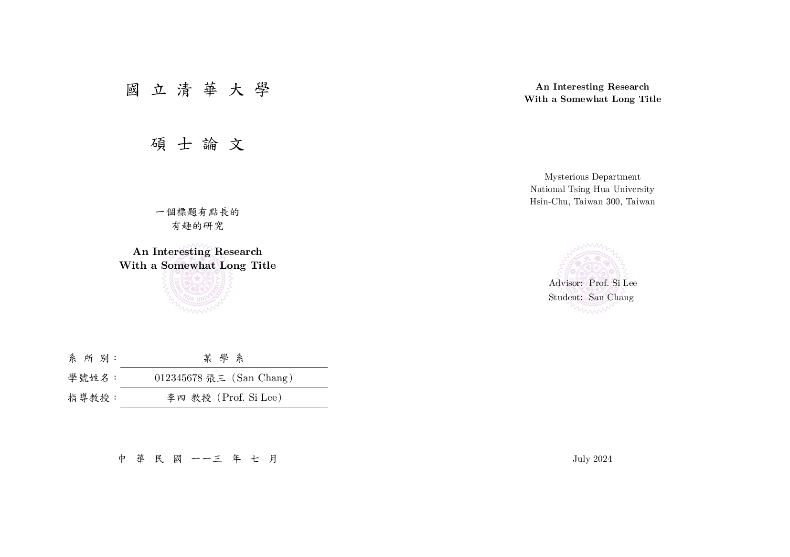

# canonical-nthu-thesis

A [Typst](https://typst.app/docs/) template for master theses and doctoral dissertations for NTHU (National Tsing Hua University).

國立清華大學碩士（博士）論文[Typst](https://typst.app/docs/)模板。

- [Typst Universe Package](https://typst.app/universe/package/canonical-nthu-thesis)
- [Codeberg Repo](https://codeberg.org/kotatsuyaki/canonical-nthu-thesis)




## Usage

### Installing the Chinese fonts

This template uses the official fonts from the Ministry of Education of Taiwan (Edukai/TW-MOE-Std-Kai), which are required to be downloaded and installed manually from [language.moe.gov.tw](https://language.moe.gov.tw/001/Upload/Files/site_content/M0001/edukai-5.0.zip).  For the Typst web app, upload the font to the project directory.

此模板中文部分使用教育部標準楷書字體（Edukai/TW-MOE-Std-Kai），在編譯文件前需要自[language.moe.gov.tw](https://language.moe.gov.tw/001/Upload/Files/site_content/M0001/edukai-5.0.zip)下載並手動安裝。若使用的是Typst web app，則需要下載後上傳至Typst專案內。


### Editing

All the content of the thesis are in the `thesis.typ` file.
The metadata shown in the cover pages are described in the `#let info = (...)` dictionary in `thesis.typ`.
Replace the values with your own metadata.

所有論文內容皆位於`thesis.typ`檔案內。顯示在論文中英封面上的資訊由`thesis.typ`中的`#let info = (...)`字典而來。

-----

The library (`lib.typ`) exposes some definitions that defines the styling and the contents of the thesis.

- `cover-pages(info)`: Generates the cover pages in Traditional Chinese and English.  The `info` dictionary contains the metadata of the thesis.
- `outline-pages`: The outline pages for the chapters and sections, the figures, and the tables.
- `body(margin)`: Generates a function to be used as an "everything" show rule.  Example: `#show: body(margin: (x: 1in, y: 2in))` starts the body part of the thesis with the horizontal and vertical margins overridden as 1 inch and 2 inches, respectively.
- `preface(margin)`: Generates a function to be used as an "everything" show rule.


### Local usage

```sh
$ typst init @preview/canonical-nthu-thesis:0.1.0 my-thesis
$ cd my-thesis
$ typst watch thesis.typ
```


## Development

Development and issue tracking happens on the [repository on Codeberg](https://codeberg.org/kotatsuyaki/canonical-nthu-thesis).


## License

This project is licensed under the MIT License.
