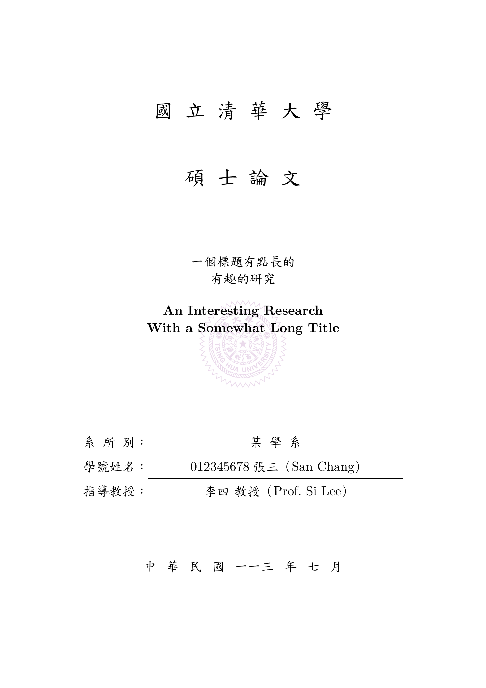

# nthu-thesis

A [Typst](https://typst.app/docs/) template for master theses and doctoral dissertations for NTHU (National Tsing Hua University).

國立清華大學碩士（博士）論文[Typst](https://typst.app/docs/)模板。




## Usage

### Local usage

Initialize the template in a directory called `my-thesis`.  This template uses the official fonts from the Ministry of Education of Taiwan (Edukai/TW-MOE-Std-Kai), so the user must specify the font path when compiling.

在名為`my-thesis`的目錄下使用此模板。此模板使用教育部標準楷書字體（Edukai/TW-MOE-Std-Kai），故編譯時需以`--font-path ./fonts/`聲明字體路徑。

```sh
$ typst init @preview/nthu-thesis:0.1.0 my-thesis
$ cd my-thesis
# Use the fonts under ./fonts/
$ typst watch --font-path ./fonts/ thesis.typ
```

-----

All the content of the thesis are in the `thesis.typ` file.
The metadata shown in the cover pages are described in the `#let info = (...)` dictionary in `thesis.typ`.
Replace the values with your own metadata.

所有論文內容皆位於`thesis.typ`檔案內。顯示在論文中英封面上的資訊由`thesis.typ`中的`#let info = (...)`字典而來。


## License

This project is licensed under the MIT License.

The bundled Edukai font is licensed under CC-BY-ND 3.0 by the Ministry of Education of Taiwan.
